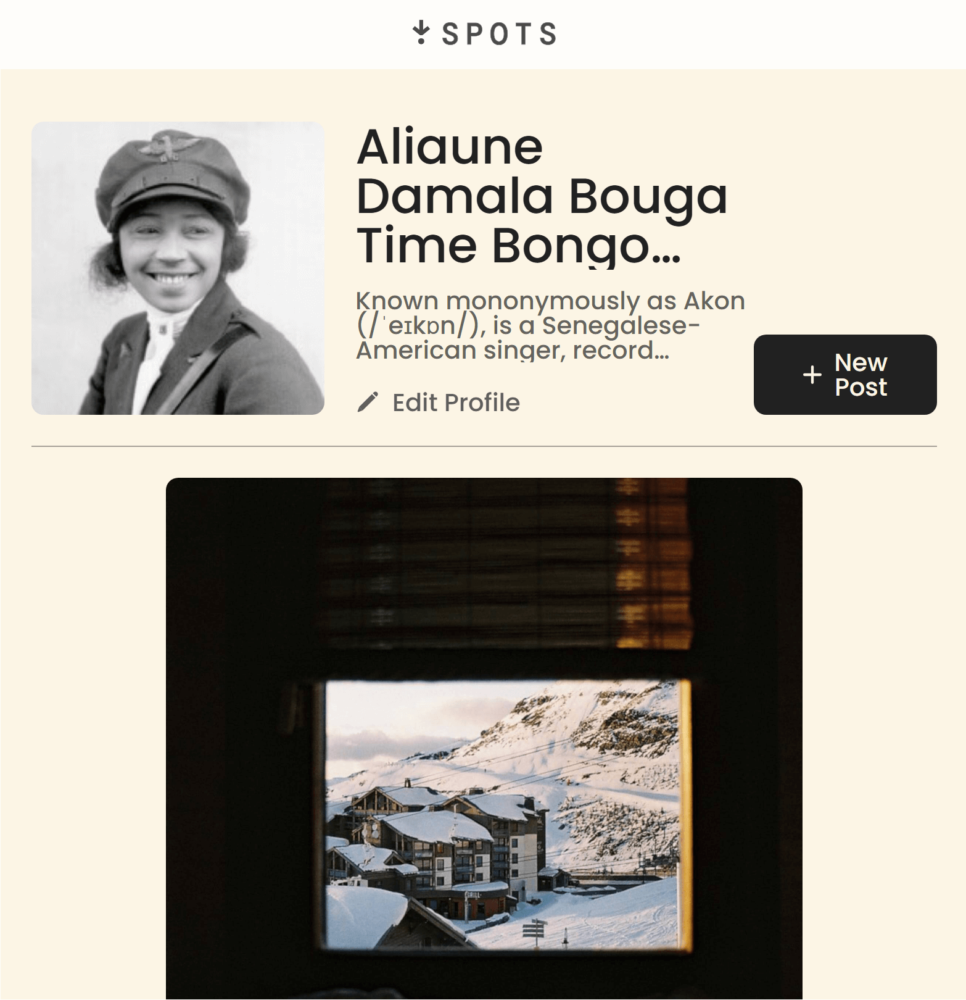

# Project 3: Spots

## Website URL

[Spots Site](https://softwareapprentice.github.io/se_project_spots/)

## Website Video Explanation

[Video Documentation](https://www.loom.com/share/2fdc81a7d09c41a6b9c09e4c839bc8ca)

### Overview

- Description
- techniques
- Intro
- Figma
- Images

**Project Description**

Provide a place to post and share pictures of your adventures.
user's are able to see a see your pictures and like your post.

**Technique**

applied grid technique to organize the posts and additional posts will expand the contents size and removal of posts will shrink the the contents size.

applied media queries allowing the webpage to adapt to different screen sizes, reducing clutter or object being improperly displayed on screen.

fig 1. Desktop display

fig 2. Media query used for mobile display

**Intro**

This project is made so all the elements are displayed correctly on popular screen sizes. We recommend investing more time in completing this project, since it's more difficult than previous ones.

**Figma**

- [Link to the project on Figma](https://www.figma.com/file/BBNm2bC3lj8QQMHlnqRsga/Sprint-3-Project-%E2%80%94-Spots?type=design&node-id=2%3A60&mode=design&t=afgNFybdorZO6cQo-1)

**Images**

The way you'll do this at work is by exporting images directly from Figma — we recommend doing that to practice more. Don't forget to optimize them [here](https://tinypng.com/), so your project loads faster.

Good luck and have fun!
